# Advanced OOP-Based Parking Lot System in Java

An enterprise-grade, clean-code, and highly extensible console-based **Parking Lot Management System** built in pure Java. This project serves as a reference implementation for a low-level system design (LLD) interview question, fully demonstrating Core Object-Oriented Programming (OOP) concepts, SOLID principles, design patterns, and thread safety.

---

## 📖 Table of Contents
1. [System Requirements & Scope](#-system-requirements--scope)
2. [Domain Model & Class Hierarchy](#-domain-model--class-hierarchy)
3. [Design Patterns Explained](#-design-patterns-explained)
4. [SOLID Design Principles Mapping](#-solid-design-principles-mapping)
5. [Core Use Cases & Detailed Flows](#-core-use-cases--detailed-flows)
6. [Concurrency & Thread Safety](#-concurrency--thread-safety)
7. [Getting Started & Usage](#-getting-started--usage)
8. [Extensibility (Future Enhancements)](#-extensibility-future-enhancements)

---

## 🎯 System Requirements & Scope

The parking lot system manages the lifecycle of parking vehicles within a multi-floor facility:
1. **Multi-Floor Support**: The parking lot contains multiple floors, each containing various types of parking spots.
2. **Vehicle Support**: Supports multiple vehicle types—Motorcycles, Cars, and Trucks.
3. **Spot Compatibility**: Parking spots are classified by size (`MotorcycleSpot`, `CompactSpot`, `LargeSpot`). A vehicle can only park in a spot that accommodates its size:
   - Motorcycle spots fit only Motorcycles.
   - Compact spots fit Cars and Motorcycles.
   - Large spots fit Trucks, Cars, and Motorcycles.
4. **Real-time Occupancy Display**: Each floor has an independent electronic `DisplayBoard` showing the count of free spots for each category.
5. **Entry Gate Processing**: Issues a unique `ParkingTicket` indicating the assigned spot and timestamp, then marks the spot as occupied.
6. **Exit Gate Billing & Payment**: Scans the ticket, computes the fee based on vehicle type and duration (rounded up to the nearest hour), processes payment (Cash or Card), and frees the spot.
7. **Admin Operations**: Admins can dynamically modify the configuration (add/remove floors, spots, change allocation and billing strategies).

---

## 🏗️ Domain Model & Class Hierarchy

The project uses inheritance and interface implementation to structure the code logically:

```mermaid
classDiagram
    class Vehicle {
        <<Abstract>>
        -String licensePlate
        -VehicleType type
        -ParkingTicket ticket
    }
    class Car {
        +Car(String licensePlate)
    }
    class Motorcycle {
        +Motorcycle(String licensePlate)
    }
    class Truck {
        +Truck(String licensePlate)
    }
    Vehicle <|-- Car
    Vehicle <|-- Motorcycle
    Vehicle <|-- Truck

    class ParkingSpot {
        <<Abstract>>
        -String spotId
        -int floorNumber
        -Vehicle parkedVehicle
        +isFree() boolean
        +canFit(Vehicle) boolean*
        +park(Vehicle)
        +unpark()
    }
    class CompactSpot {
        +canFit(Vehicle) boolean
    }
    class MotorcycleSpot {
        +canFit(Vehicle) boolean
    }
    class LargeSpot {
        +canFit(Vehicle) boolean
    }
    ParkingSpot <|-- CompactSpot
    ParkingSpot <|-- MotorcycleSpot
    ParkingSpot <|-- LargeSpot

    class SpotAllocationStrategy {
        <<Interface>>
        +allocateSpot(Vehicle, List~ParkingFloor~) ParkingSpot
    }
    class NearestSpotAllocationStrategy {
        +allocateSpot(Vehicle, List~ParkingFloor~) ParkingSpot
    }
    SpotAllocationStrategy <|.. NearestSpotAllocationStrategy

    class FeeCalculationStrategy {
        <<Interface>>
        +calculateFee(double duration, VehicleType) double
    }
    class FlatHourlyFeeStrategy {
        +calculateFee(double duration, VehicleType) double
    }
    FeeCalculationStrategy <|.. FlatHourlyFeeStrategy

    class Payment {
        <<Abstract>>
        -String txnId
        -double amount
        -PaymentStatus status
        -long timestamp
        +process() boolean*
    }
    class CardPayment {
        -String cardNumber
        -String cardHolderName
        +process() boolean
    }
    class CashPayment {
        -double amountTendered
        -double changeReturned
        +process() boolean
    }
    Payment <|-- CardPayment
    Payment <|-- CashPayment

    class Gate {
        <<Abstract>>
        -String gateId
    }
    class EntranceGate {
        +issueTicket(Vehicle) ParkingTicket
    }
    class ExitGate {
        +calculateFee(ParkingTicket, long) double
        +processPayment(ParkingTicket, Payment, long) boolean
    }
    Gate <|-- EntranceGate
    Gate <|-- ExitGate

    class ParkingLot {
        -static ParkingLot instance
        -String name
        -String address
        -List~ParkingFloor~ floors
        -List~ParkingTicket~ tickets
        -List~Payment~ payments
        -SpotAllocationStrategy allocationStrategy
        -FeeCalculationStrategy feeStrategy
        +initialize(name, address) ParkingLot
        +getInstance() ParkingLot
    }
    class ParkingFloor {
        -int floorNumber
        -List~ParkingSpot~ spots
        -DisplayBoard displayBoard
        +parkVehicle(Vehicle, ParkingSpot)
        +unparkVehicle(ParkingSpot)
        +updateDisplayBoard()
    }
    class DisplayBoard {
        -String boardId
        -Map~String, Integer~ freeSpotCounts
        +printDisplay()
    }

    ParkingLot "1" *-- "many" ParkingFloor
    ParkingLot "1" *-- "many" EntranceGate
    ParkingLot "1" *-- "many" ExitGate
    ParkingFloor "1" *-- "1" DisplayBoard
    ParkingFloor "1" *-- "many" ParkingSpot
```



---

## 🎨 Design Patterns Explained

To demonstrate clean-code architecture, four major design patterns are utilized:

### 1. Singleton Pattern (`ParkingLot.java`)
- **Problem**: We need a single global coordinator to track floors, active tickets, and transaction logs. Multiple instances would lead to data concurrency issues and spot mismatches.
- **Solution**: The `ParkingLot` class hides its constructor (`private ParkingLot(...)`) and exposes a thread-safe static initialization method (`initialize(name, address)`) and access method (`getInstance()`). Double-checked synchronization guarantees safety across multi-threaded applications.

### 2. Strategy Pattern (`SpotAllocationStrategy.java` & `FeeCalculationStrategy.java`)
- **Problem**: Spot allocation rules (e.g., parking nearest to entrance vs. floor-wise balancing) and billing rules (e.g., flat hourly vs. peak-hour pricing) vary dynamically depending on operations.
- **Solution**:
  - We decoupled these rules from the main execution flow. 
  - `EntranceGate` delegates spot matching to `SpotAllocationStrategy`.
  - `ExitGate` delegates fee computation to `FeeCalculationStrategy`.
  - This allows the system behavior to be swapped at runtime without changing the code inside the gates.

### 3. Observer Pattern (Implicit Event notifications in `ParkingFloor.java`)
- **Problem**: Whenever a vehicle checks in or out, the available spot count changes. The display boards must be updated immediately to show valid states.
- **Solution**: The `ParkingFloor` controls spot availability. Whenever `parkVehicle()` or `unparkVehicle()` is executed, the floor recalculates its free counts and pushes the update to its associated `DisplayBoard` object. This maintains state consistency.

### 4. Simple Factory concept (`Main.java` initialization)
- Factory behaviors are incorporated when instantiating subclasses of `Vehicle` and `ParkingSpot` dynamically based on inputs (CLI inputs, test scripts).

---

## 📐 SOLID Design Principles Mapping

| Principle | Description | Applied in Codebase |
| :--- | :--- | :--- |
| **S** | **Single Responsibility Principle** | Every class has one reason to change. `ParkingTicket` only stores ticket metadata; `FlatHourlyFeeStrategy` only performs calculation math; `ExitGate` orchestrates checkout execution but does not perform the direct payment processing or math computation. |
| **O** | **Open-Closed Principle** | The codebase is open for extension but closed for modification. If we need to support an `ElectricCar` and an `ElectricChargingSpot`, we can subclass `Vehicle` and `ParkingSpot` and define a new compatible `canFit` override. We do not need to modify `EntranceGate` or `ParkingFloor` classes. |
| **L** | **Liskov Substitution Principle** | Subclasses can seamlessly stand in for their parent types. An `EntranceGate` expects a generic `Vehicle` parameter. It will successfully issue a ticket and allocate a spot whether the runtime object passed is a `Car`, a `Motorcycle`, or a `Truck`. |
| **I** | **Interface Segregation Principle** | Strategy interfaces are segregated and lean. `SpotAllocationStrategy` only declares `allocateSpot()`. `FeeCalculationStrategy` only declares `calculateFee()`. Clients implement exactly what they need. |
| **D** | **Dependency Inversion Principle** | High-level modules do not depend on low-level modules; both depend on abstractions. `ParkingLot` holds references to the strategy interfaces `SpotAllocationStrategy` and `FeeCalculationStrategy` rather than concrete implementations like `NearestSpotAllocationStrategy` and `FlatHourlyFeeStrategy`. |

---

## 🔄 Core Use Cases & Detailed Flows

### 1. Vehicle Entry Flow (Check-in)

The diagram below represents how the system handles parking:

```
[Driver] ──> Enters ──> [EntranceGate]
                           │
                           ├─> Queries ParkingLot for Strategy & Floors
                           ├─> SpotAllocationStrategy.allocateSpot(vehicle, floors)
                           │      └─> Scans spots, checks spot.canFit(vehicle)
                           │
                           ├─> ParkingFloor.parkVehicle(vehicle, spot)
                           │      └─> spot.park(vehicle)
                           │      └─> Recalculates free spots
                           │      └─> DisplayBoard.update() (Observer pattern)
                           │
                           ├─> Creates ParkingTicket(spot)
                           └─> vehicle.setTicket(ticket)
```

### 2. Vehicle Exit Flow (Checkout & Payment)

The checkout process tracks duration, pricing, billing, and release of resources:

```
[Driver] ──> Exit Gate ──> Passes Ticket / Plate ──> [ExitGate]
                                                        │
                                                        ├─> Calculates elapsed duration (simulated or real-time)
                                                        ├─> FeeCalculationStrategy.calculateFee(duration, vehicleType)
                                                        │
                                                        ├─> Payment.process() (e.g. CardPayment, CashPayment)
                                                        │      └─> Validates transactions, sets Status = COMPLETED
                                                        │
                                                        ├─> ParkingTicket.markPaid(fee, exitTime)
                                                        ├─> ParkingFloor.unparkVehicle(spot)
                                                        │      └─> spot.unpark()
                                                        │      └─> Recalculates free spots
                                                        │      └─> DisplayBoard.update() (Observer pattern)
                                                        │
                                                        └─> vehicle.setTicket(null)
```

---

## 🔒 Concurrency & Thread Safety

In highly loaded parking systems, multiple vehicles attempt to enter and exit different gates simultaneously. To prevent race conditions (such as allocating the same parking spot to two different vehicles at the same time), the following synchronization strategies are applied:

1. **Singleton Thread Safety**: The `ParkingLot` initializer is marked `synchronized` to prevent multiple threads from instantiating duplicate parking lots:
   ```java
   public static synchronized ParkingLot initialize(String name, String address) { ... }
   ```
2. **Atomic Allocation & State Updates**: In production environments, the core allocation search and parking spot status updates must reside within a synchronized block or utilize locks. In our model, `EntranceGate.issueTicket(vehicle)` utilizes the singleton's active state, and parking spot assignments change spot states atomically by throwing exceptions if another thread has occupied the spot between the lookup and the write phases.

---

## 🔧 Getting Started & Usage

### 🚀 Commands Cheat Sheet
Ensure you have **Maven** and **Java 17+** configured on your local system path.

* **Compile the code:**
  ```bash
  mvn clean compile
  ```
* **Run automated unit tests:**
  ```bash
  mvn test
  ```
* **Launch the console application simulator:**
  ```bash
  mvn exec:java -Dexec.mainClass="com.parkinglot.Main"
  ```

---

## 🔮 Extensibility (Future Enhancements)

The system design accommodates future requirement changes with ease:
1. **Dynamic Spot Pricing**: Easily introduce a `DynamicPricingStrategy` that scales prices up during high occupancy or peak hours.
2. **EV Charging Integration**: Subclass `ParkingSpot` to create `ElectricSpot` which checks compatibility only for `ElectricCar` instances and tracks electricity usage costs.
3. **Automated Parking Reservation**: Reserve parking spots in advance by adding a `Reservation` ledger to the `ParkingLot` singleton and blocking spot allocations for designated reservation windows.
